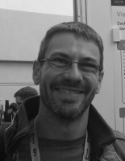

# Motivación

Esta es la página principal de mi proyecto académico, con ella tengo la intención de mantener la máxima rigurosidad y
facilitar a mis tutores el seguimiento de mi progreso, mantener una estructura clara de mis ideas y perseguir la excelencia.

# Proyectos

Cada proyecto tiene su propia carpeta de documentación y la raíz es esta página principal.

 - [Trabajo Fin de Máster](TFM/index.md)
 - [Tesis Doctoral](TS/index.md)

# Tutores

Mis referentes académicos son una parte muy importante de mí, tengo mucho que aprender de ellos. En 3º de carrera no tenía
pensado continuar con mis estudios y fueron exactamente estas dos personas las que promovieron mi interés por la ciencia.
No puedo dejar de mencionar tampoco a mi tío Jose Luis Albaráñez, me transmitió su interés por el conocimiento como una 
máxima.

### [Juan José Pantrigo](http://caporesearch.es/jjpantrigo/)

  

 - Profesor en la Universidad Rey Juan Carlos, en la Escuela Técnica Superior de Ingeniería Informática.
 - Miembro del grupo de investigación [CAPO](http://caporesearch.es/).
 - Licenciado en CC. Físicas por la Universidad de Extremadura, España.
 - Doctor por la Universidad Rey Juan Carlos en 2005.
 - Experto en la hibridación de técnicas de optimización y de estimación secuencial para resolver problemas de seguimiento visual.
 - Su línea de interés se centra en la aplicación de métodos de aprendizaje profundo (deep learning) en problemas de visión artificial complejos tales como el seguimiento de movimiento articulado, reconocimiento y detección visual o reconocimiento de actividades humanas, entre otros.  
 - [Página web personal](http://caporesearch.es/jjpantrigo/).
 - E-mail: juanjose.pantrigo@urjc.es

### [Emanuele Schiavi](https://gestion2.urjc.es/pdi/ver/emanuele.schiavi)

  

 - Profesor en la Universidad Rey Juan Carlos, en la Escuela Técnica Superior de Ingeniería Informática.
 - Licenciado en CC. Matemáticas por la Universidad de Genoa, Italia.
 - Doctor en Matemática Aplicada por la Universidad Complutense de Madrid en 1197.
 - Experto en el análisis y resolución de las formulaciones variacionales de Ecuaciones Diferenciales en Derivadas Parciales que aparecen en física matemática, mecánica de fluidos y ciencias de la naturaleza..
 - Su línea de interés se centra en el análisis y procesado de imágenes digitales especialmente en modalidades médicas donde desarrolla algoritmos eficientes para los protocolos de clasificación, segmentación, registro, flujo óptico, eliminación de bias, artefactos, ruido y emborronamiento..  
 - [Página web personal](https://gestion2.urjc.es/pdi/ver/emanuele.schiavi).
 - E-mail: emanuele.schiavi@urjc.es

# Sobre mí

  

- Técnico Superior en Electromecánica y Automoción.
- Graduado en Desarrollo y Diseño de Videojuegos por la Universidad Rey Juan Carlos.
- Estudiante del Máster Universitario en Visión Artificial en la Universidad Rey Juan Carlos.
- Mis intereses son los Gráficos por Computador y la Inteligencia Artificial, sobre todo centrado en problemas como la detección de objetos y los agentes inteligentes.
- [Página web personal](https://www.linkedin.com/in/javieralbaranezmartinez/)
- E-mail: j.albaranez@alumnos.urjc.es

# Colaboradores

# Metodología

Dejo establecido github como punto que centraliza todo lo relacionado con mi proyecto académico. Donde:
- **Issues** marca los pasos a realizar, estableciendo referencias entre las tareas por hacer y el código modificado. 
- **Discussions** como centro de mensajes entre mis tutores y yo, donde se puede organizar todo por tema de conversación y permite hacer un seguimiento posterior.
- **Projects** como una forma de plasmar en lo que estoy trabando y los proyectos en los que se desglosa. Cada proyecto cuenta con una planificación independiente organizada en columnas: to do, in progress y done. Cada tarjeta representa una tarea a realizar y se encuentra vinculada con las Issues.
- **Wikis** queda reservado como aquel lugar en la que plasmar cosas que interese mantener en privado.

Cada proyecto a su vez consta de documentación. Donde:
- En los apartados descritos como **diario** ire realizando entradas, organizadas por fecha, y detallaré los problemas encontrados y sus respectivas soluciones.
- En **resultados**, mostraré resultados tanto cuantitativos como cualitativos y tanto positivos como negativos, acompañandolos de un pequeño resumen.
- Y por último, en las **guías** mostraré la forma de ejecutar el código que desarrolle.
